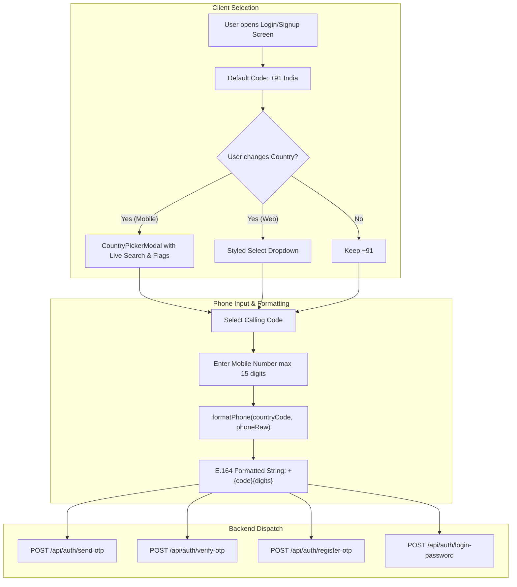

# Feature Specification & Implementation: International Country Code Dropdown

**Document Status:** Implemented & Documented  
**Target Platforms:** Mobile App (React Native / Expo), Website (React / Vite), API Backend  
**Directory Location:** `docs/planning/COUNTRY_CODE_DROPDOWN_FEATURE.md`  
**Date:** September 2026  

---

## 1. Executive Overview & Problem Statement

### 1.1 Context
Mai-Hoonaa (MHN) provides elderly companion care, healthcare support, and assisted living services. While elder beneficiaries reside locally in India, many subscribing family members, primary caregivers, and sponsors are non-resident Indians (NRIs) or international clients residing across North America, the UK, Europe, the Middle East, and Southeast Asia.

### 1.2 Prior Limitations
- **Hardcoded Indian Code:** Both the mobile app and website previously hardcoded the `+91` calling code prefix across phone number inputs and OTP confirmation dialogs.
- **Fixed Phone Length Validation:** Input fields enforced a strict 10-digit maximum length (`maxLength={10}`), rejecting valid international numbers that differ in length.
- **Inability to Authenticate:** International users were unable to receive OTPs or sign up with their overseas mobile numbers.

### 1.3 Solution Implemented
A global country calling code selector with search and flag icons was designed and integrated across both the **Mobile App** and **Web Portal**. This enables users globally to authenticate, register, and receive SMS OTPs seamlessly.

---

## 2. Architecture & Design Specifications



---

## 3. Mobile App Implementation (`apps/mobile-app`)

### 3.1 Dependencies
- `country-codes-list`: Used to generate the complete list of ISO countries, country names, calling codes, and flag emojis without network latency or external API dependencies.

### 3.2 Modal Component: `CountryPickerModal.tsx`
- **File:** `apps/mobile-app/components/ui/CountryPickerModal.tsx`
- **Component Architecture:**
  - **Slide-up Bottom Sheet:** Implemented using React Native's `<Modal>` with backdrop dismiss.
  - **Performance Optimization:** Built using `useMemo` for cached country parsing and alphabetized sorting.
  - **Search Bar:** Real-time query filter supporting matches against country name, calling code digits, and ISO-2 alpha country codes.
  - **Item Layout:** Displays country flag emoji, localized full name, formatted `+{callingCode}`, and a primary-colored checkmark icon (`#FE6700`) for the actively selected item.
  - **Theming:** Aligned with Mai-Hoonaa branding (Orange accent `#FE6700`, Poppins typography, rounded surfaces).

### 3.3 Auth Screens Integration
1. **Login Screen (`apps/mobile-app/app/(auth)/index.tsx`):**
   - Added `countryCode` state (defaulting to `"91"`).
   - Replaced static text container with an interactive trigger box showing `+{countryCode}` and a subtle chevron icon.
   - Updated phone input `maxLength` from `10` to `15` to support international standard E.164 ranges.
   - Updated OTP prompt text to dynamically reflect `+{countryCode} {phone}`.
   - Payload to backend uses `+${countryCode}${cleanPhone}`.

2. **Registration Screen (`apps/mobile-app/app/(auth)/register.tsx`):**
   - Integrated `CountryPickerModal` for the subscriber registration form.
   - Maintained unified styling and centering for the country prefix trigger.
   - Applied dynamic calling codes to `send-otp`, `verify-otp`, and user creation payloads.

---

## 4. Website Implementation (`apps/website`)

### 4.1 Dependencies
- `country-codes-list`: Installed in `apps/website` to populate country codes.
- `lucide-react`: `ChevronDown` icon for custom dropdown styling.

### 4.2 API Services Layer (`apps/website/src/services/api.js`)
Updated phone formatting logic and all authentication API calls:

```javascript
/**
 * Format phone to international E.164 format or standard calling format
 */
export const formatPhone = (countryCode, phoneRaw, prefixPlus = true) => {
  const clean = String(phoneRaw || '').replace(/\D/g, '');
  if (!clean) return '';
  const prefix = String(countryCode || '91').replace('+', '');
  return prefixPlus ? `+${prefix}${clean}` : `${prefix}${clean}`;
};
```

Updated API signatures:
- `sendOtp(countryCode, phoneRaw, turnstileToken)`
- `verifyOtp(countryCode, phoneRaw, otpCode)`
- `registerWithOtp({ countryCode, phoneRaw, name, age, email, ... })`
- `loginWithPassword({ countryCode, phoneRaw, password, turnstileToken })`

### 4.3 Auth Page (`apps/website/src/pages/AuthPage.jsx`)
- Replaced the hardcoded `+91` box with a modern `<select>` element wrapped in a custom border and background container matching the site design.
- Synced `countryCode` across OTP Login, Password Login, and OTP Registration tabs.
- Maintained clean layout alignment with the mobile phone input field.
- Updated feedback messages: `"We've sent a 6-digit verification code to +${countryCode} ${cleanPhone}"`.

---

## 5. File Inventory & Changes

| Platform | File Path | Action | Description |
| :--- | :--- | :--- | :--- |
| **Mobile App** | `apps/mobile-app/components/ui/CountryPickerModal.tsx` | Created | Bottom sheet modal with search, flags, country list, and selection logic. |
| **Mobile App** | `apps/mobile-app/app/(auth)/index.tsx` | Modified | Added country picker trigger, state, dynamic phone formatting, and extended max length. |
| **Mobile App** | `apps/mobile-app/app/(auth)/register.tsx` | Modified | Integrated country code selection, OTP submission with international code. |
| **Mobile App** | `apps/mobile-app/package.json` | Modified | Added `country-codes-list` dependency. |
| **Website** | `apps/website/src/services/api.js` | Modified | Refactored `formatPhone` and API calls to accept dynamic `countryCode`. |
| **Website** | `apps/website/src/pages/AuthPage.jsx` | Modified | Custom select UI for country calling codes, synced state, updated OTP messages. |
| **Website** | `apps/website/package.json` | Modified | Added `country-codes-list` dependency. |

---

## 6. Verification & Quality Assurance Checklist

- [x] **Default Behavior:** Retains `+91` (India) as the default selection on initial load across all platforms.
- [x] **Country Search (Mobile):** Searching by country name (e.g., "United Kingdom", "United States", "UAE", "Germany"), ISO code ("US", "GB"), or calling code ("1", "44", "971") filters the list in real-time.
- [x] **UI Responsiveness:** Layouts adapt smoothly on standard and compact mobile screens with centered text alignment and balanced chevrons.
- [x] **Input Length Flexibility:** Mobile phone input accepts up to 15 digits (`maxLength={15}`) without arbitrary truncation.
- [x] **API Payload Accuracy:** Verified that payloads sent to `/api/auth/send-otp` and `/api/auth/verify-otp` include the chosen country code in E.164 format.
- [x] **Website Production Build:** Ran `npm run build` on `apps/website` to ensure clean compilation without syntax or bundle errors.

---

## 7. Future Recommendations

1. **Auto-detect Country via IP or Geolocation:**
   - Detect user location using GeoIP / Reverse Geocoding on app launch and pre-select the detected country code while allowing manual override.
2. **Dynamic Number Length Validation (libphonenumber-js):**
   - Integrate `libphonenumber-js` for per-country phone number format and length validation (e.g., ensuring US numbers are 10 digits, UK numbers are 10–11 digits).
3. **SMS Provider International Routing:**
   - Ensure the upstream SMS gateway (e.g., Twilio, AWS SNS, MSG91) has international SMS delivery enabled for destinations outside India.
